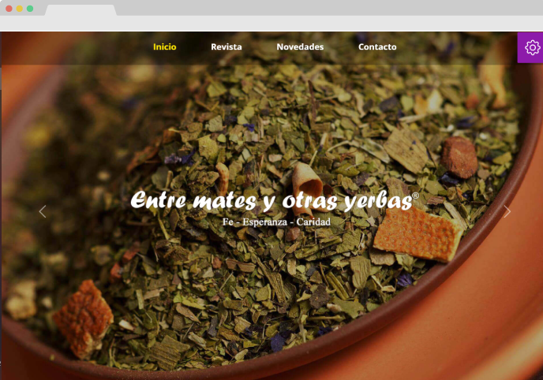

<div id="top"></div>

<!-- PROJECT LOGO -->
<br />
<div align="center">
  <a href="https://github.com/lopezrunco/Entrematesyotrasyerbas-2022-frontend">
    
  </a>

<h3 align="center">Entrematesyotrasyerbas-2022-frontend</h3>

  <p align="center">
    Blog app of "Entre mates y otras yerbas" radio show
    <br />
    <br />
    <a href="https://entrematesyotrasyerbas.com.uy/">View Demo</a>
  </p>
</div>


<!-- TABLE OF CONTENTS -->
<details>
  <summary>Table of Contents</summary>
  <ol>
    <li>
      <a href="#about-the-project">About The Project</a>
      <ul>
        <li><a href="#built-with">Built With</a></li>
      </ul>
    </li>
    <li>
      <a href="#getting-started">Getting Started</a>
      <ul>
        <li><a href="#prerequisites">Prerequisites</a></li>
        <li><a href="#installation">Installation</a></li>
      </ul>
    </li>
  </ol>
</details>


<!-- ABOUT THE PROJECT -->
## About The Project



"Entre mates y otras yerbas" is a radio show broadcasted in Uruguay. Its mission is to share with the audience the healing virtues of medicinal herbs: their use and their dose. This blog aims to reach a broader audience by posting the highlights of the radio program in article format.

<p align="right">(<a href="#top">back to top</a>)</p>


### Built With


<p align="right">(<a href="#top">back to top</a>)</p>


<!-- GETTING STARTED -->
## Getting Started

### Prerequisites

* node.js
* npm

### Installation

2. Clone the repo
   ```sh
   git clone https://github.com/lopezrunco/Entrematesyotrasyerbas-2022-frontend.git
   ```
3. Install NPM packages
   ```sh
   npm install
   ```
4. Start app
   ```sh
   npm start
   ```

<p align="right">(<a href="#top">back to top</a>)</p>